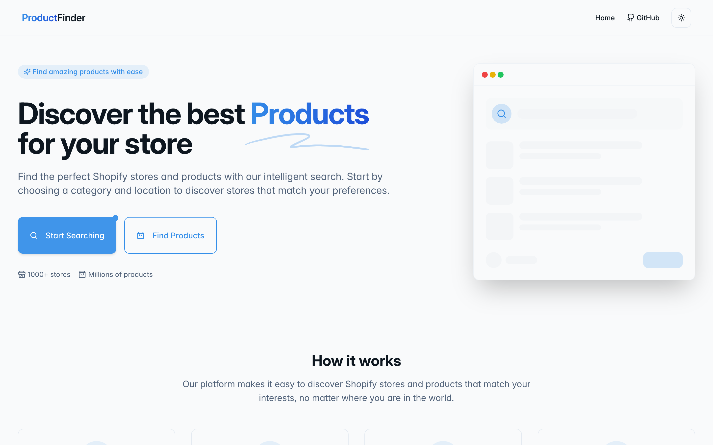
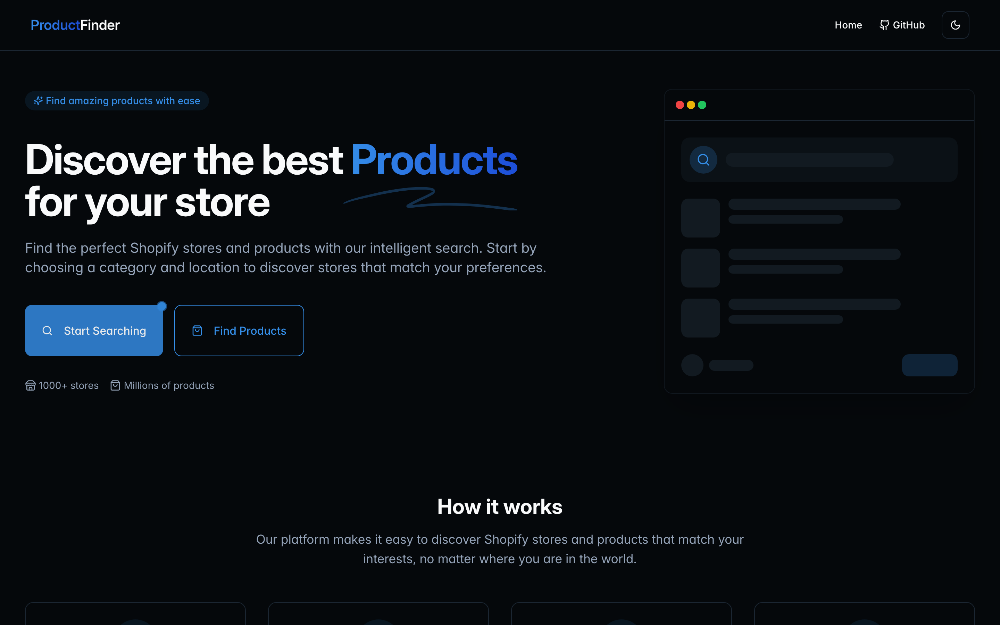
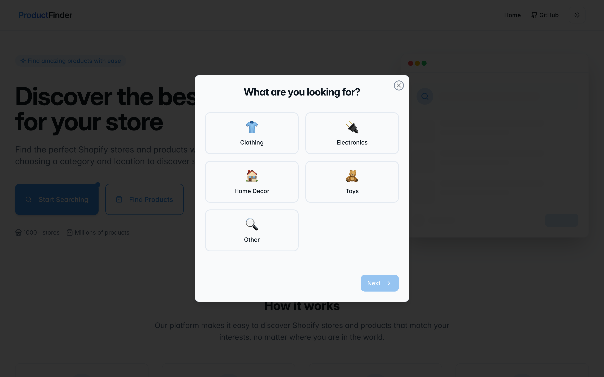
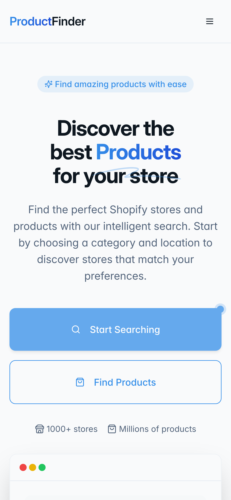

# ProductFinder 🛍️🔎

**Find the perfect Shopify stores and products — by category and by country — without the endless tab-hopping.**

ProductFinder is a fast, friendly search front-end that helps you discover Shopify
stores selling what you actually want, then dives into a store's catalog so you can
browse its products at a glance. Pick a category, pick a location, and let the finder
do the digging. No more "I swear there was a store that sold exactly this."

<p align="center">
  
</p>

---

## ✨ Features

- **Guided onboarding search** — a two-step modal walks you from *"what are you looking for?"* to *"where are you located?"* so every search starts with intent.
- **Category quick-picks** — Clothing, Electronics, Home Decor, Toys, or roll your own with a custom category.
- **Country targeting** — ten popular markets baked in (US, UK, CA, AU, NZ, IN, DE, FR, JP, PK) plus any ISO 3166-1 alpha-2 code you like.
- **Store results at a glance** — clean cards with the store title, a snippet, and its domain, each linking straight to the shop.
- **Drill into a store's catalog** — tap *View Products* on any result to pull that store's product grid, complete with images and direct product links.
- **Working light / dark theme toggle** — powered by `next-themes`, it remembers your choice and respects your system preference.
- **Fully responsive** — a proper mobile nav drawer, fluid grids, and touch-friendly targets from phone to desktop.
- **SEO-aware** — per-page titles, descriptions, and Open Graph / Twitter meta via `react-helmet`.

<p align="center">
  
</p>

---

## 🧱 Built with

- [**Vite**](https://vitejs.dev/) — lightning-fast dev server & build
- [**React 18**](https://react.dev/) + [**TypeScript**](https://www.typescriptlang.org/)
- [**Tailwind CSS**](https://tailwindcss.com/) + [**shadcn/ui**](https://ui.shadcn.com/) (Radix primitives)
- [**React Router**](https://reactrouter.com/) for client-side routing
- [**TanStack Query**](https://tanstack.com/query) for data fetching plumbing
- [**lucide-react**](https://lucide.dev/) icons, [**sonner**](https://sonner.emilkowal.ski/) toasts, [**next-themes**](https://github.com/pacocoursey/next-themes)

---

## 🚀 Getting started

New to all this? No worries — you'll be up and running in about two minutes.

### Prerequisites

You only need **Node.js 18+** and **npm** (npm ships with Node). Check what you have:

```sh
node -v   # should print v18.x or newer
npm -v
```

Don't have Node? Grab it from [nodejs.org](https://nodejs.org/) or install it with
[nvm](https://github.com/nvm-sh/nvm#installing-and-updating) (recommended if you juggle
multiple projects).

### Install & run

```sh
# 1. Clone the repository
git clone https://github.com/waleedsworld/toy-hunter-quest.git

# 2. Hop into the project
cd toy-hunter-quest

# 3. Install the dependencies
npm install

# 4. Start the dev server (hot-reload included)
npm run dev
```

Vite will print a local URL (default **http://localhost:8080**). Open it in your
browser and start searching. 🎉

### Build for production

```sh
npm run build      # outputs an optimized bundle to dist/
npm run preview    # serve the production build locally to sanity-check it
```

---

## 🔌 The search API

ProductFinder talks to a small backend that handles the actual store search and
sitemap crawling. The endpoint lives in `src/services/api.ts`:

```ts
const API_URL = "https://productfinder.techrealm.online";
```

- `GET /search?query=<category>&location=<code>&limit=<n>` → matching stores
- `GET /sitemap?url=<domain>&limit=<n>` → products for a given store

Want to point at your own backend? Change that one constant and you're set.

---

## 📁 Project structure

```
src/
├─ components/        UI building blocks (HeroSection, StoreCard, OnboardingModal, ThemeToggle…)
│  └─ ui/             shadcn/ui primitives
├─ pages/             Index (search) · StoreProducts · NotFound
├─ services/          api.ts — the search + sitemap client
├─ types/             shared TypeScript interfaces
├─ hooks/             use-mobile, use-toast
└─ lib/               utilities (cn, etc.)
```

---

## 🖼️ A few more looks

| Onboarding | Mobile |
| :--------: | :----: |
|  |  |

---

## 🌐 Live demo

Live demo — deploying soon.

---

## 📝 License

Released under the MIT License. Happy hunting! 🧸
